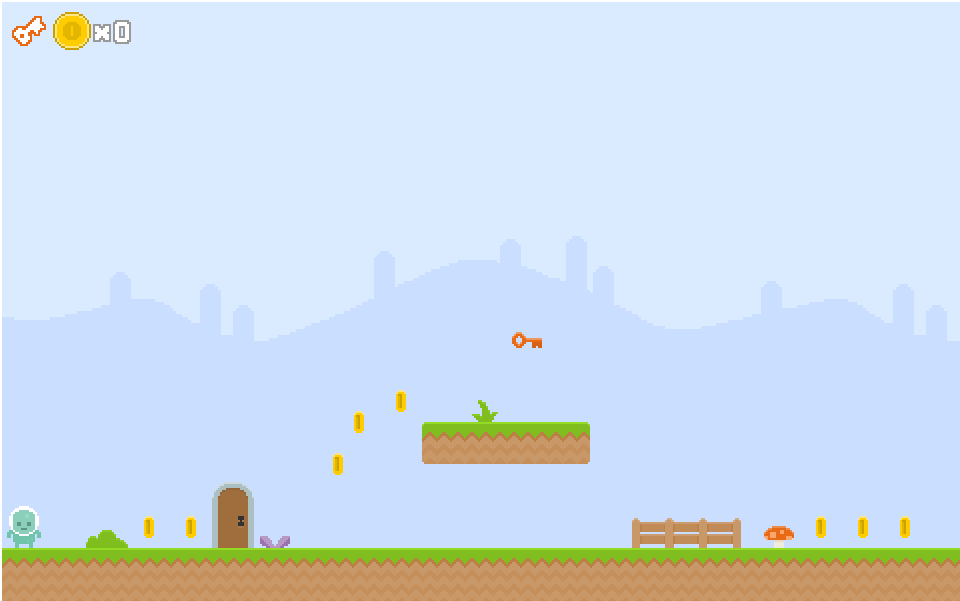
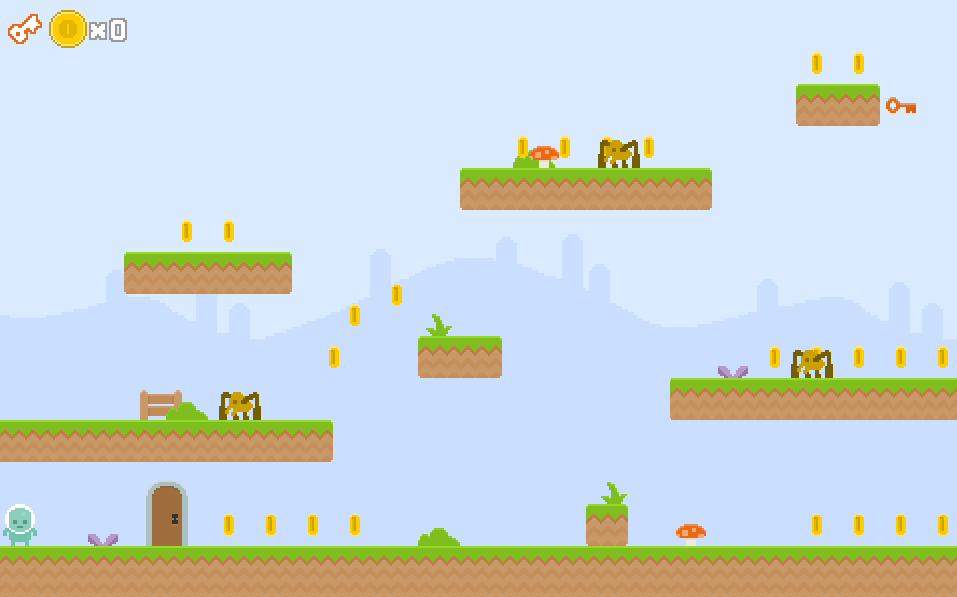

# JSGames by Alejandro Caralt Caralt
## My First Game with Pure JavaScript

<a href="https://losmonitores.000webhostapp.com/MiPrimerJuegoJS/index.html" > Try it here! </a>

## My First Game with <a href="https://Phaser.io"> Phaser JSFrameWork</a>
### Source: <a href="https://mozdevs.github.io/html5-games-workshop/en/guides/platformer/start-here/" >Tutorial completa</a>

<a href="https://losmonitores.000webhostapp.com/MiPrimerJuegoPhaser/index.html" > Try it here! </a> 
### Os recomiendo esta publicación sobre crear juegos Indie:
https://gamedevelopment.tutsplus.com/articles/1gam-how-to-succeed-at-making-one-game-a-month--gamedev-3695
